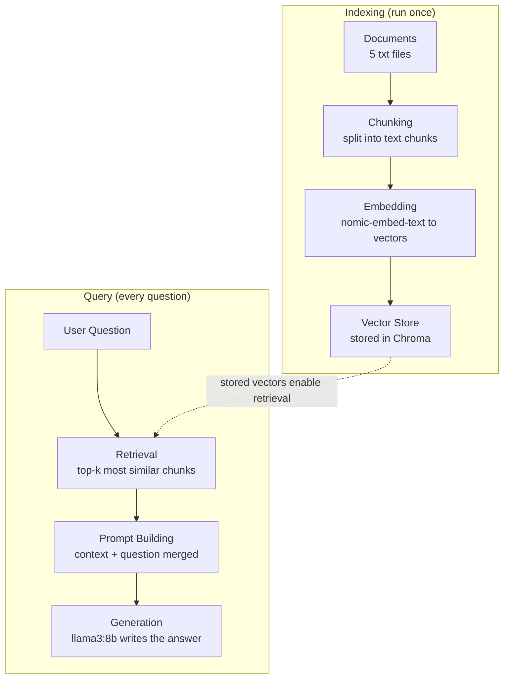

## Goal

Step back from the code and map out the full data flow of the RAG pipeline
built this week: documents in, answers out.

## Architecture

## Key takeaway

Indexing and query are two independent lifecycles: indexing runs once to
build the knowledge base, while query runs on every question. The vector
store is the connection point between them — which is exactly why it
becomes its own attack surface (next week's poisoning experiments target
this connection point).

